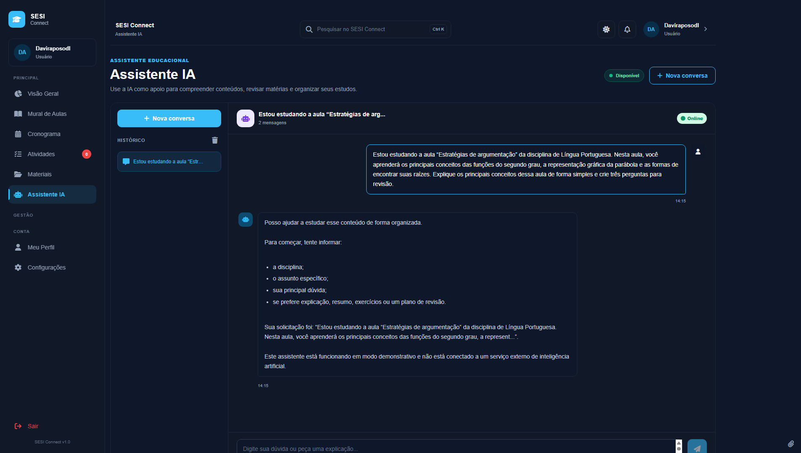

# 🏫 SESI Connect

### Tecnologia, educação e inovação em um só lugar.

A **SESI Connect** é uma organização voltada ao desenvolvimento de soluções tecnológicas para o ambiente educacional, com foco em facilitar o acesso ao conhecimento, melhorar a organização dos recursos pedagógicos e aproximar alunos e professores por meio da tecnologia.

---

## 🚀 Sobre a Organização

A **SESI Connect** surgiu a partir da necessidade de desenvolver uma solução capaz de centralizar diferentes recursos utilizados durante a rotina escolar.

Nosso principal projeto é o **SESI Connect**, uma plataforma educacional que reúne materiais pedagógicos, aulas, atividades, cronogramas, gravações e recursos de Inteligência Artificial em um único ambiente digital.

A organização tem como objetivo aplicar conhecimentos de **desenvolvimento de software, banco de dados, inteligência artificial e design de interfaces** para criar soluções que possam contribuir com a educação.

---

## 🎯 Nossa Missão

Desenvolver soluções tecnológicas que tornem o acesso à educação mais **organizado, acessível, eficiente e inovador**.

---

## 💡 Projeto Principal

### 📚 SESI Connect

O **SESI Connect** é uma plataforma educacional destinada a alunos e professores da rede SESI.

A plataforma busca solucionar dificuldades relacionadas ao acesso aos materiais disponibilizados pelos professores e à participação em aulas e aulões preparatórios.

### Principais recursos

* 🔐 Autenticação de usuários;
* 👨‍🎓 Gerenciamento de alunos;
* 👨‍🏫 Gerenciamento de professores;
* 📚 Mural de aulas;
* 📝 Atividades e exercícios;
* 📅 Cronograma;
* 📂 Materiais pedagógicos;
* 🎥 Gravações de aulas e aulões;
* 📖 Apostilas e materiais de apoio;
* ❓ Questões e listas de exercícios;
* 🤖 Recursos de Inteligência Artificial;
* 👤 Perfil de usuário;
* ⚙️ Configurações.

---

## 🛠️ Tecnologias

### Front-end

### Back-end

### Banco de Dados

### Ferramentas

### Inteligência Artificial

O projeto também prevê a integração com **modelos de Inteligência Artificial generativa**, utilizados para auxiliar professores na criação de questões, listas de exercícios e sugestões de atividades educacionais.

---

## 👥 Equipe

O SESI Connect é desenvolvido por:

| Integrante         |
| ------------------ |
| **Jael Feijó**     |
| **Davi Raposo**    |
| **Emmanuel Vitor** |
| **Kauã Riquelme**  |
| **Eduardo Lucas**  |
| **Rafael Rocha**   |
| **Gabriel Lima**   |
| **Manoel Ricardo** |
| **Nicolas Maciel** |

---

## 📂 Repositórios

### 🔗 SESI Connect

Repositório principal do projeto:

**[Acessar o projeto](https://github.com/davirlima7-debug/sesi-connect)**

> Outros repositórios e projetos desenvolvidos pela organização serão adicionados futuramente.

---

## 📸 Projeto

### Interfaces do SESI Connect

### Dashboard

### Mural de Aulas

### Atividades

### IA Educacional

---

## 📊 Status

🚧 **SESI Connect — Em desenvolvimento**

O projeto está sendo desenvolvido gradualmente, com novas funcionalidades, melhorias na interface e integração de tecnologias sendo adicionadas durante o processo.

---

## 🌐 Organização

**SESI Connect**

> Educação • Tecnologia • Inovação

---

  Desenvolvido pela equipe SESI Connect

